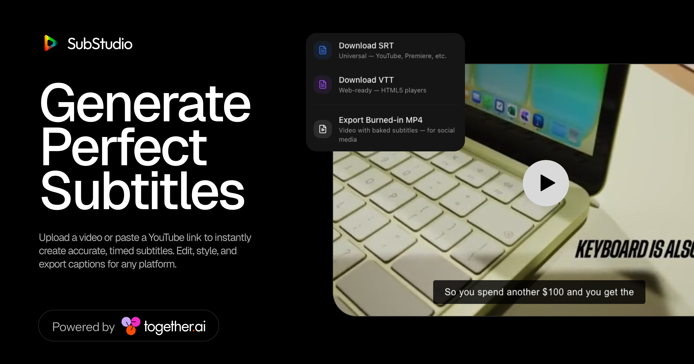

# [SubStudio](https://substudio.ai) — generate perfect subtitles with AI

Upload a video or paste a YouTube link to instantly create accurate, timed subtitles. Edit, style, and export captions for any platform. Powered by [Together AI](https://together.ai).

[](https://substudio.ai)

## How it works

SubStudio uses [Together AI's](https://together.ai) Whisper Large v3 model to transcribe your video with word-level timestamps. It automatically merges short intervals into readable subtitle blocks, then lets you preview and style them in real-time with preset styles (Classic, TikTok, Minimal, etc.).

1. **Upload** a video file or paste a YouTube link
2. **Transcribe** — audio is extracted and sent to Together AI's Whisper endpoint for fast, accurate transcription
3. **Edit & Export** — preview styled subtitles in real time, then download as SRT, VTT, or burned-in MP4

## Running Locally

### Cloning the repository

```bash
git clone https://github.com/Luffixos/ai-subtitles.git
cd ai-subtitles
```

### Getting a Together AI API key

1. Go to [Together AI](https://api.together.ai/settings/api-keys) to create an account
2. Copy your API key

### Storing the API key in .env

Create a `.env` file in the root directory and add your key:

```
TOGETHER_API_KEY=your_api_key_here
```

Or you can enter it directly in the app by clicking the key icon in the top-right corner.

### Installing dependencies

```bash
npm install
```

### Running the application

```bash
npm run dev
```

The app will be available at `http://localhost:3000`.

## Tech stack

- **Framework**: [Next.js](https://nextjs.org/) (App Router)
- **AI**: [Together AI](https://together.ai) — Whisper Large v3 for transcription
- **Animations**: [Framer Motion](https://www.framer.com/motion/)
- **Styling**: [Tailwind CSS](https://tailwindcss.com/)
- **Video Processing**: FFmpeg (via `fluent-ffmpeg`)

## License

This repo is MIT licensed.
